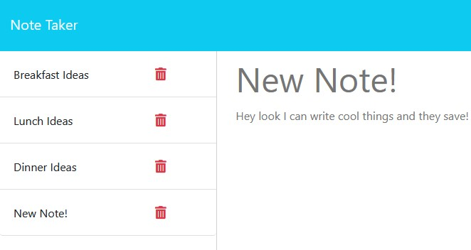

# ExpressJS Note Taker

## User Story
* AS A small business owner
* I WANT to be able to write and save notes
* SO THAT I can organize my thoughts and keep track of tasks I need to complete

## Installation
 * clone repository from this [link](https://github.com/cxrstings/ExpressJS-NoteTaker)
 * run ***npm i***, then run ***node server.js***

 ## Usage
 * Watch me use the program on video [here](https://drive.google.com/file/d/1FhEEw8S8QFgvDZZnixKdspVM3Eggvw_Z/view)

 